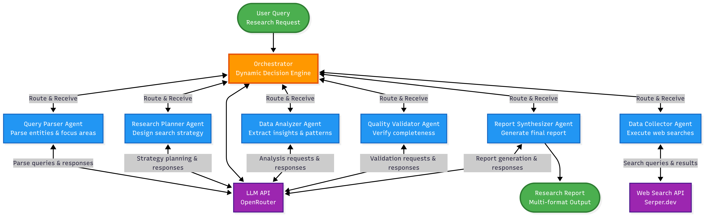

# AI-Powered Multi-Agent Research System

A sophisticated, dynamic multi-agent system that performs comprehensive research and analysis using autonomous AI agents. The system demonstrates true agentic orchestration with non-linear workflows, inter-agent communication, and intelligent task delegation.

## 🚀 Features

- **6 Specialized AI Agents**: Query Parser, Research Planner, Data Collector, Data Analyzer, Quality Validator, and Report Synthesizer
- **Dynamic Orchestration**: Non-sequential, intelligent agent coordination with back-and-forth communication
- **Generic Domain Support**: Works across any research domain (CRM, Accounting, Project Management, etc.)
- **Comprehensive Analysis**: Multi-faceted research with quality validation and iterative improvement
- **Rich Output Formats**: Markdown reports, HTML visualizations, JSON data, and structured comparisons
- **Professional Interface**: Clean terminal output with progress tracking and detailed logging

## 🏗️ System Architecture

The system uses a centralized orchestrator that intelligently routes tasks between specialized agents based on their outputs and current state. This enables:

- **Non-linear Workflows**: Agents can loop back for additional research or analysis
- **Inter-agent Communication**: Agents delegate tasks and build upon each other's work
- **Quality Gates**: Built-in validation ensures comprehensive research before final reporting
- **Adaptive Behavior**: The system adjusts its approach based on research quality and completeness



## 🛠️ Installation

1. **Clone the repository**
   ```bash
   git clone <repository-url>
   cd AgenticResearch
   ```

2. **Install dependencies**
   ```bash
   pip install -r requirements.txt
   ```

3. **Set up environment variables**
   ```bash
   cp env.template .env
   # Edit .env with your API keys
   ```

4. **Configure API keys**
   - Get a [Serper API key](https://serper.dev/) for web search
   - Get an [OpenRouter API key](https://openrouter.ai/) for LLM access
   - Add both keys to your `.env` file

## 🎯 Usage

### Basic Usage
```bash
python main.py
```

### Interactive Mode (Recommended for demos)
```bash
python main.py --interactive
```

### Custom Query
```bash
python main.py --query "Your research question here"
```

### Example Queries
- **CRM Tools**: "Compare HubSpot, Zoho, and Salesforce for small businesses"
- **Accounting Software**: "Evaluate QuickBooks, Xero, and Sage for mid-size companies"
- **Project Management**: "Analyze Asana, Trello, and Monday.com for remote teams"

## 📊 Output

The system generates multiple output formats:

- **`research_report.md`**: Comprehensive markdown report with analysis and comparison tables
- **`research_report.html`**: Visual HTML report with charts and formatting
- **`structured_comparison.json`**: Machine-readable comparison data
- **`agent_communication_log.txt`**: Detailed log of agent interactions

## 🔧 Configuration

Key configuration options in `config.py`:

- **LLM Model**: Switch between Claude 3.5 Sonnet and Gemini 2.5 Pro
- **Research Iterations**: Control maximum research cycles
- **Timeout Settings**: Adjust research time limits
- **Default Entities**: Set fallback research targets

## 🎪 Demo Capabilities

Perfect for technical demonstrations showcasing:

- **Agentic Orchestration**: Real-time agent decision-making and task delegation
- **Non-sequential Flows**: Agents looping back for additional research
- **Quality Validation**: Built-in scoring and improvement cycles
- **Dynamic Adaptation**: System adjusting strategy based on results

## 📈 Sample Performance

- **Execution Time**: 2-5 minutes per research cycle
- **Agent Interactions**: 10-15 dynamic interactions
- **Data Collection**: 15-20 web searches per project
- **Report Quality**: 5000+ character comprehensive reports
- **Coverage**: 100% entity coverage with quality scores 6-10/10

## 🏆 Technical Highlights

- **State Management**: Centralized JSON state sharing between agents
- **Robust Parsing**: Handles inconsistent LLM output with intelligent cleaning
- **Search Variation**: Prevents redundant searches with query diversification
- **Business Context**: Dynamically extracts and incorporates business context
- **Error Handling**: Graceful fallbacks and retry mechanisms

## 📋 Requirements

- Python 3.8+
- Internet connection for web search and LLM API calls
- Valid API keys for Serper and OpenRouter services

## 🤝 Contributing

This project demonstrates advanced multi-agent system design and can be extended with:

- Additional agent types for specialized research tasks
- Enhanced integration capabilities
- Custom output formats and visualizations
- Advanced orchestration strategies

## 📄 License

This project is created for educational and demonstration purposes.

---

## 📊 Sample Research Report

*The following is a report generated by the system for a CRM comparison query using Google Gemini 2.5 Pro:*

### **Research Report: CRM Platform Comparison for Small to Mid-Size B2B Businesses**

**Subject:** A Comparative Analysis of HubSpot, Zoho, and Salesforce
**Prepared For:** Management Evaluating CRM Tools

### **1. Executive Summary**

This report provides a comprehensive comparison of HubSpot, Zoho, and Salesforce, tailored for small to mid-size B2B businesses (SMBs). The analysis reveals that these three market leaders, while all offering powerful CRM solutions, are strategically positioned to serve different business archetypes, growth trajectories, and budget philosophies.

*   **HubSpot** is the ideal choice for businesses prioritizing ease of use, a strong inbound marketing focus, and a low-risk entry point. Its "land-and-expand" model, beginning with a robust free CRM, allows companies to grow into a tightly integrated, all-in-one platform, though costs can escalate with team size.
*   **Zoho** presents the most compelling value proposition, particularly through its **Zoho One** suite. It acts as a complete "business operating system" at an unparalleled price point, but its restrictive "All-Employee" licensing model makes it suitable only for specific company structures. Its **Zoho CRM Plus** offering provides a more flexible, direct competitor to HubSpot and Salesforce.
*   **Salesforce** positions itself as the premium, highly scalable, and customizable solution. It aims to be the last CRM a company will ever need. While its entry-level plan is accessible, it is highly limited, and businesses should anticipate significant cost increases as they grow and require more advanced functionality.

The decision between these platforms is a strategic one. It requires a thorough evaluation of not just the initial subscription fee, but the projected total cost of ownership (TCO), your company's operational structure, and your long-term growth and integration strategy.

### **2. Side-by-Side Comparison Table**

This table provides a high-level overview of each platform across key decision-making criteria.

| Aspect | HubSpot | Zoho | Salesforce |
| :--- | :--- | :--- | :--- |
| **Core Strategy** | **All-in-One & Ease of Use:** Attracts users with a free CRM and expands them into an integrated sales, marketing, and service platform. | **Unmatched Value & Breadth:** Offers an entire suite of business apps for one low price (Zoho One) or a powerful, flexible CRM bundle (CRM Plus). | **Scalability & Customization:** Provides a platform that can scale from a single user to a global enterprise, with a vast ecosystem for customization. |
| **Pricing Philosophy** | Per-user, per-month, with a robust free tier. Costs scale predictably with user count. | Two models: 1) **Zoho One:** All-employee licensing for maximum value. 2) **CRM Plus:** Flexible per-user licensing. | Premium per-user, per-month model with steep price jumps between tiers. Designed for long-term growth. |
| **Key SMB Tiers** | • **Free CRM:** Permanently free core tools.<br>• **Sales Hub Starter:** ~$15/user/month.<br>• **Professional Tier:** Higher cost for automation & advanced features. | • **Zoho One:** ~$45/user/month (All-Employee plan).<br>• **Zoho CRM Plus:** $69/user/month (Flexible plan). | • **Essentials:** $25/user/month.<br>• **Professional:** $75 - $100/user/month. |
| **Key Features** | • Lead & deal tracking<br>• Live chat & email marketing<br>• Simple automation<br>• User-friendly interface<br>• Integrated Marketing & Service Hubs | • **Zoho One:** 45+ apps (CRM, Finance, HR, Projects, etc.)<br>• **CRM Plus:** ~14 apps for sales, marketing, helpdesk, analytics, and social media. | • Lead & opportunity management<br>• Customizable reports & dashboards<br>• Mobile access<br>• Comprehensive tools in Professional+ tiers. |
| **Integration Strategy** | Strong native integration between its own "Hubs" (Sales, Marketing, etc.). "Ops Hub" focuses on connecting third-party apps. | **Zoho One:** A fully pre-integrated ecosystem is its primary strength.<br>**CRM Plus:** Integrates well with other Zoho apps and third parties. | Market-leading ecosystem via the **AppExchange**, offering thousands of third-party apps for any business need. |
| **Key Limitations** | • Per-seat costs can become expensive for larger teams.<br>• "Jack of all trades, master of none" on some advanced features.<br>• Feature-gating forces upgrades to costly tiers. | • **Zoho One's** "All-Employee" pricing is restrictive and not viable for all company structures.<br>• Potential for overwhelming complexity and unused apps ("shelfware"). | • **Essentials plan is highly restrictive** (10-user max, 1GB storage).<br>• Steep "cost cliff" when upgrading from Essentials to Professional.<br>• High Total Cost of Ownership (TCO) including implementation, add-ons, and training. |
| **Ideal For** | Startups and SMBs that value ease of use, an all-in-one solution, and have a strong inbound marketing focus. | **Zoho One:** Tech-forward companies where most employees need software access.<br>**CRM Plus:** Businesses needing a powerful, flexible CRM suite at a competitive price. | Businesses planning for rapid or large-scale growth that need a highly customizable, scalable platform and have the budget to support it. |

### **3. Detailed Platform Analysis**

#### **HubSpot: The User-Friendly, All-in-One Platform**

*   **Overview & Market Position:** HubSpot has secured a dominant position in the SMB market by focusing on user-friendliness and providing an integrated, all-in-one customer platform. Its strategy is to "land-and-expand," attracting businesses with a powerful free CRM and then upselling them to paid "Hubs" for Sales, Marketing, and Service as their needs grow.
*   **Pricing Model:**
    *   **Free CRM:** A robust, permanently free offering for contact, deal, and task management. This is HubSpot's primary customer acquisition tool.
    *   **Starter Tiers:** Begin at approximately **$15/user/month** for the Sales Hub Starter, offering more advanced features.
    *   **Professional/Enterprise Tiers:** Pricing increases significantly, unlocking critical automation and reporting features. The per-user model means costs scale linearly with team growth.
*   **Key Features for B2B SMBs:** The platform is built around the core needs of a growing business: lead capture and management, deal pipeline visualization, email templates and tracking, meeting scheduling, and live chat. Its renowned user interface reduces training time and encourages adoption.
*   **Integrations:** HubSpot's greatest integration strength is the seamless connection between its own products (e.g., a marketing email click is instantly visible on the contact's record in the sales CRM). The "Ops Hub" is dedicated to syncing data with third-party applications, though businesses must verify that their critical stack (e.g., ERP, accounting) is supported.
*   **Limitations & Considerations:**
    *   **Total Cost of Ownership (TCO):** While the entry point is low, the per-seat model can become a significant operational expense for a growing team.
    *   **Feature Gating:** Many essential automation and reporting features are reserved for the more expensive Professional tier, creating a "price wall" for businesses that outgrow the Starter plan.
    *   **"Jack of All Trades":** For companies with highly specialized needs (e.g., advanced sales analytics), a best-of-breed point solution may offer deeper functionality than the equivalent HubSpot module.

#### **Zoho: The Unbeatable Value Proposition**

*   **Overview & Market Position:** Zoho competes aggressively on price and breadth of offering. It segments the market with two distinct but powerful bundles. **Zoho CRM Plus** is a direct competitor to HubSpot and Salesforce's SMB offerings, while **Zoho One** is a market disruptor that aims to replace a company's entire software stack.
*   **Pricing Model:**
    *   **Zoho One:** Approximately **$45/user/month** with the "All-Employee Pricing" model. This requires the company to purchase a license for *every single employee*, regardless of their role. A "Flexible User" plan is available at a higher, unlisted price.
    *   **Zoho CRM Plus:** A more traditional offering at **$69/user/month**, allowing companies to purchase licenses only for the users who need them (e.g., sales and marketing teams).
*   **Key Features for B2B SMBs:**
    *   **Zoho One** includes over 45 applications, covering CRM, finance (Zoho Books), HR (Zoho People), project management (Zoho Projects), and more. It is a true "operating system for a business."
    *   **Zoho CRM Plus** is a curated bundle of customer-facing tools, including advanced CRM, marketing automation (SalesIQ), helpdesk software (Desk), and analytics (Analytics).
*   **Integrations:** This is Zoho's core strength. Within the Zoho One ecosystem, all applications are pre-integrated, creating a single source of truth across all business functions, from a sales lead to a final invoice.
*   **Limitations & Considerations:**
    *   **Restrictive Licensing:** The "All-Employee" requirement for Zoho One is its biggest hurdle. It is financially unviable for businesses with many non-desk workers (e.g., manufacturing, logistics).
    *   **Complexity and Adoption:** The sheer breadth of Zoho One can be overwhelming. There is a high risk of paying for unused applications ("shelfware") without a dedicated implementation and training strategy.

#### **Salesforce: The Scalable, Enterprise-Grade Leader**

*   **Overview & Market Position:** Salesforce is the undisputed market leader in CRM. For SMBs, it positions itself as a premium, scalable platform that a business will never outgrow. Its strategy is to provide an accessible entry point and a clear, albeit expensive, upgrade path to enterprise-grade power and customization.
*   **Pricing Model:**
    *   **Essentials:** **$25/user/month**. This is the entry-level plan, designed for very small businesses.
    *   **Professional:** **$75 - $100/user/month**. This is the true starting point for most growing SMBs, offering more comprehensive features and removing the key limitations of the Essentials plan.
    *   Pricing jumps are significant between tiers.
*   **Key Features for B2B SMBs:** Salesforce provides best-in-class lead, account, and opportunity management. Its key strength lies in its deep customization capabilities, allowing businesses to tailor the platform to highly specific sales processes. The reporting and forecasting engines are exceptionally powerful, even at the Professional level.
*   **Integrations:** Salesforce's primary advantage is the **AppExchange**, a massive marketplace of thousands of third-party applications. This ecosystem ensures that a business can connect Salesforce to virtually any other software and extend its functionality to meet any need.
*   **Limitations & Considerations:**
    *   **Severe Entry-Level Restrictions:** The Essentials plan has a hard limit of **10 users** and a meager 1GB of file storage. This forces growing teams to make a large financial leap to the Professional plan.
    *   **The "Cost Cliff":** The 3x-4x price increase from Essentials to Professional can be a budget shock for SMBs.
    *   **High TCO:** The subscription fee is just the beginning. Businesses must budget for implementation, data migration, training, and potentially costly apps from the AppExchange to get the full value, making it the most expensive option long-term.

### **4. Actionable Recommendations**

Your choice of CRM should be guided by your company's size, growth trajectory, budget, and operational philosophy.

**Choose HubSpot if:**
*   You are a startup or small business looking for your first CRM and want to start with a powerful free tool.
*   Your team values ease of use and quick adoption above deep customization.
*   Your business strategy is heavily reliant on inbound marketing and content.
*   You prefer a single, integrated platform for sales, marketing, and service from one vendor.

**Choose Zoho if:**
*   **(Zoho One):** You are a tech-forward company where most employees are desk-based, and you want to consolidate your entire software stack for an unbeatable price. You must perform the cost calculation: `(Total Employees x $45)` to see if it's viable.
*   **(Zoho CRM Plus):** You need a powerful, feature-rich CRM suite that is more affordable than Salesforce Professional and more flexible than Zoho One's licensing. This is a strong choice for budget-conscious businesses with more than 10 CRM users.

**Choose Salesforce if:**
*   You are planning for rapid or significant long-term growth and want a platform that will scale with you indefinitely.
*   You have complex or unique sales processes that require deep customization.
*   You need access to the largest possible ecosystem of third-party integrations (AppExchange).
*   You have the budget to support a higher total cost of ownership and view the CRM as a core strategic investment.

**Final Decision Framework:** Before making a final decision, your team should:
1.  **Project Your 3-Year Headcount:** Calculate the total subscription cost for each platform based on your anticipated team size in three years.
2.  **Define "Must-Have" Features:** Identify which features are non-negotiable and confirm they are included in the specific tier you are evaluating to avoid forced upgrades.
3.  **Map Your Integration Needs:** List all business-critical software (accounting, ERP, etc.) and verify the quality and cost of integration for each CRM platform.
4.  **Request Personalized Demos:** Do not rely on marketing materials. Engage with sales teams for a demo tailored to your specific B2B use cases.

---

*This report was generated by the AI-Powered Multi-Agent Research System using Google Gemini 2.5 Pro for comprehensive CRM platform analysis.*
